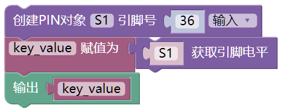
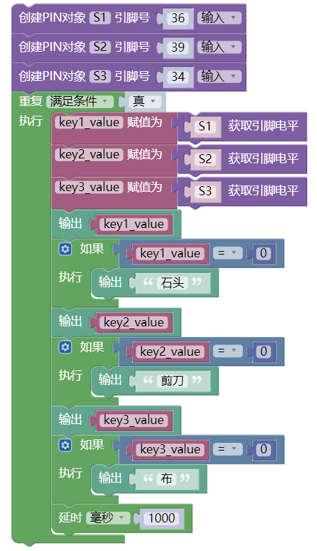
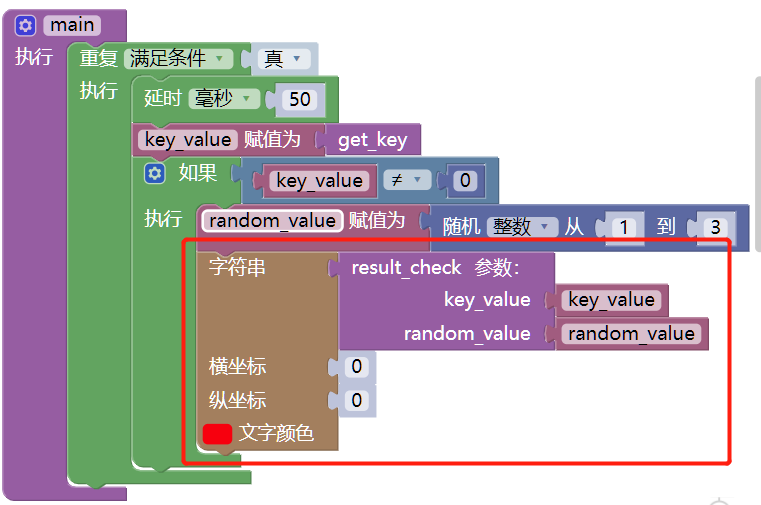

# 猜拳游戏


## 游戏规则

>有剪刀、石头、布三个手势。二人同时用手做出相应形状而出，输赢判断规则为：剪刀赢布，布赢石头，石头赢剪刀。

基于skids开发猜拳游戏：人机对战。

玩家输入：skids上的4个按键：S1-石头/右移，S2-剪刀/下移动，S3-布/左移，S4确认/上移

游戏结果：LCD屏幕输出文字或图案


## 设计思路

游戏设计上可拆分为几个部分：
* 显示-用于输出游戏结果或提醒，在屏幕上显示文字实现，实现中屏幕的功能最后添加，前期先用调试方式开发游戏主题部分；
* 输入-按键输入用户的选择；
* 逻辑-判断游戏的胜负平

高级功能：
* 图形化人机交互
* 网络版，真人PK

实现上我们计划由简至繁来完成，先完成一个具备游戏功能的框架，然后在进行逐步完善。分为几个部分：
* 游戏主体设计
* 屏幕文本支持
* 屏幕图形化支持
* 网络板实现

本章中将实现前两个功能，后面两个功能待后续项目开展中逐步完善。

# 游戏主体设计

为了实现上的简单，我们先不支持显示功能，只使用终端输出进行游戏设计。终端输出实际上就是软件调试中最常用的方法，最经典的hello world就是在终端显示的。

实现思路是：

* 用输出代替屏幕
* 随机数对应石头、剪刀、布
* 实现按键输入对应石头、剪刀、布
* 实现胜负逻辑判断

## 输出代替屏幕


输出功能更像是让机器说话，告诉我们它出的是什么。

输入可以通过blockly输入，也可以直接在命令行输入。blockly中选择"文本"->"输出":


在uPyCraft工具中找到PC识别到Skids的串口进行选择，正常情况下uPyCraft左侧device中会有文件`boot.py`被识别到。把blockly中生成的代码复制到boot.py文件中，下载并执行。


这里也可以是命令行直接输入，在上图最下方">>>"位置输入：


```python
print('hello world')
```

    hello world
    

尝试中文输出：大家好，我是skids。


```python
print('大家好，我是skids')
```

    大家好，我是skids
    

在这里我们会发现，命令行中段不能输入中文，但是可以在文件编辑中输入，并从终端打印出来。这是因为命令输入中对中文没有支持。

注意：这里要用到uPyCraft

同样的方法，我们实现游戏开机内容打印：

````
猜拳游戏

S1-石头  S2-剪刀
S3-布   S4确认
```

//TODO


**语法：**

* Python 可以使用引号( ' )、双引号( " )、三引号( ''' 或 """ ) 来表示字符串，引号的开始与结束必须是相同类型的。
* 屏幕上看到的文本内容均可认为是字符串

## 随机数

### 生成随机数

Skids代表的另外一方要模拟对手完成游戏，那么就需要能够随机的输出：石头、剪刀、布。比较简单的想法是用随机出现的1，2，3代表。我们使用`数学`中的`随机数`模块来产生随机数，并用`输出`进行打印。


```python
import random

print('猜拳游戏')
print('S1-石头 S2-剪刀')
print('S3-布   S4-确认')
print(random.randint(1, 3))
```

这里出现了`import random`语句，其功能是**导入**random模块，以便可以使用random的一些功能。我们可以多执行几次来验证是否能随机的输出1，2，3。方法是在uPyCraft中device下的boo.py上右键选择`run`完成执行。

当然为了更方便的测试，我们会想到能不能让最后的语句`print(random.randint(1, 3))`不断的执行？

为实现这个目的，可使用循环执行的功能。这个功能在逻辑中可找到，`逻辑->重复 满足条件`，然后把上面的随机数输出放到重复里面。当然我们希望的是程序能不停的输出随机数，我们来简单的判断结果是否是随机的。

结果...有点悲剧，我们的uPycraft死机了。原因是输出的太快了。如何解决这个问题呢？

是不是可以等一会儿执行一次，例如1秒钟执行一次呢？这个方法是正确的，在程序设计尤其是单片机设计中延时是非常常见的。Blockly中的延时也是在逻辑中的。

死机问题怎么解决？可能需要使用任务管理器关掉uPycraft，然后重新启动此软件。重新打开后程序修改程序：


```python
import random
import utime

# 启动输出语句省略

while True:
  print(random.randint(1, 3))
  utime.sleep_ms(1000);
```


    ---------------------------------------------------------------------------

    ModuleNotFoundError                       Traceback (most recent call last)

    <ipython-input-1-cf32ad45bab1> in <module>()
          1 import random
    ----> 2 import utime
          3 
          4 while True:
          5   print(random.randint(1, 3))
    

    ModuleNotFoundError: No module named 'utime'


这里导入了新的库`utime`这个是与时间相关的。并且出现了`while True:`，正是这个语句完成了重复循环功能，其执行结果是条件为True就一直执行后面的2条语句。这里我们发现后面要执行的两条语句有缩进，并且True后面有个`:`，这是python语言的语法规则，在循环语句后面需要加冒号，需要循环执行的部分需要缩进。程序执行的时候就根据缩进和冒号来识别不同功能的，还有utime和random后面的`.`有指向和选择的含义，如`utime.sleep_ms`表示调用utime.py文件中的`sleepms`函数。

### 根据随机数输出石头剪刀布

上面能不断产生随机树并且打印输出了，但是打印输出的是数字，如何把这些数字和`石头`，`剪刀`，`布`对用起来呢？我们可以先描述这样一段话：

* 如果随机数是1输出"石头" 
* 如果随机数是2输出"剪刀" 
* 如果随机数是3输出"布" 

这里可对上面的话进行逻辑拆分为：“如果” +  “随机数是1”条件成立 + 那么执行“输出"石头" ”

最后的：输出"石头"，我们上面已经学习过了。

`如果`和`条件成立`我们同样可以在`逻辑`模块组中找到对应的模块，分别是：`逻辑->如果+执行`和`逻辑->相等`

从模块到语句过程如下:

图片中的`1`是从`数学`中的`0`改过来的。

如上，自己添加输出积木完成`石头输出`。


```python
if random.randint(1, 3) == 1:
  print('石头')
```

    石头
    

这里的`if`和上面的`while`类似都属于python语言的关键字，当然在其他语言中也有这两个关键字。if与while不同的是，if是判断，while是循环。if后面判断的是一个逻辑结果为真还是为假，为真则执行if后面缩进部分的代码。同样if语句后面需要`:`冒号。

当我们尝试继续进行比较时发现需要再次调用`random.randin`，而此时的值又是一个新的随机值。我们是否能把`random.randin`的值保存起来，用这个值和1，2，3进行比较呢？
答案是肯定的，程序中这种可以动态存储一个数值的叫做变量（可以变化的量），我们可以在blockly中找到`变量->赋值为`模块，把这个模块和随机数产生模块进行拼组就可以把随机数的结果赋值给变量的，每个变量有需要有一个唯一的名字便于使用时进行区分，就像每个学生都有的一个学号一样。这里我们给变量命名为value


对应代码为：


```python
value = random.randint(1, 3)
```

定义过之后就可以在`变量`组中找到value并拖放使用了。

请尝试用value变量完成判断并打印`石头`。这里实际上有一个原则，那就是变量需要先定义后使用。

对应代码为：


```python
value = random.randint(1, 3)
if value == 1:
  print('石头')
```

### 翻转：完成剪刀和布的判断并打印

翻转完成，可把这部分放入`重复`里进行循环执行。


```python
if value == 2:
  print('剪刀')
if value == 3:
  print('布')
```

    剪刀
    

完整代码：
``` python
import random
import utime

# 启动输出语句省略

while True:
  value = random.randint(1, 3)
  if value == 1:
    print('石头')
  if value == 2:
    print('剪刀')
  if value == 3:
    print('布')
  utime.sleep_ms(1000);
```

这部分内容最核心的就是获取随机数即代码`value = random.randint(1, 3)`，对应：


**语法：**

* import保留字
* while保留字
* if保留字
* 缩进：模块用缩进来表示，其他语言中用{}表示，缩进必须使用相同格式，且需要严格执行。程序执行时按这些缩进来识别对应的代码行属于哪个模块
* 变量与常量：例如value可表示不同值即为变量，数字1，2，3不能变化即为常量。变量需要先定义后使用
* 数据类型：量是有数据类型的，本节用到的是数字类型的，上一节用到的字符串也可以赋值给变量，后续将使用到。变量的类型由其值的类型决定，不用为变量声名类型

## 按键输入

### 按键原理图

按键是我们可以和程序进行交互的一种接口，就像是灯泡的开关一样，打开就亮，关闭就灭。按键传给程序的正是这个开关的变化。为了能够使用开关，我们需要先查看一下电路原理图，好弄明白开关与灯泡的关系。


### 按键创建与识别

上面原理图可以看到按键用到的引脚号分别是I34,35,36,39。并且引脚号与按键对应关系为

* S1 = KEY1 = I36
* S2 = KEY2 = I39
* S3 = KEY3 = I34
* S4 = KEY4 = I35

要想知道按键是否被按下需要用到Blockly中`Skdis`中`引脚`块组中的：
* 创建PIN对象
* 获取引脚电平

因为电路原理图中已经又从按键接了电阻到VCC，所以不需要上下拉。现在我们创建1个按键并把结果打印出来。



```python
from machine import Pin
import utime


S1 = Pin(36,Pin.IN);
key_value = S1.value();

print(key_value)
```

对应的代码如上，这里出现了`from machine import Pin`代码，这是从`machine`文件或文件夹中`Pin`文件或类。上面的代码要想检测到按键的是否变化必须重复执行才可以。请尝试使用`逻辑`中的重复执行对上述慕课进行修改，实现按键状态的打印，注意需要做延时，不然仍会想随机数中那样不断打印的。完成后代码如下：


```python
from machine import Pin
import utime


S1 = Pin(36,Pin.IN);
while True:
  key_value = S1.value();

  print(key_value)
  utime.sleep_ms(1000);
```

### 按键结果判断

如果按键被按下那么可以认为，输入了石头、剪刀、布中的一个。这里把按键把结果打印出来，同时如果按键状态为按下，即输入结果为零则打印`石头`。根据上面的代码测试，我们可以知道按下按下时key_value结果为0，没有按时结果为1。


```python
from machine import Pin
import utime


S1 = Pin(36,Pin.IN);
while True:
  key_value = S1.value();

  print(key_value)
  utime.sleep_ms(1000);
  if key_value == 0:
    print('石头')

```


    ---------------------------------------------------------------------------

    ModuleNotFoundError                       Traceback (most recent call last)

    <ipython-input-7-e4e55f5824d5> in <module>()
    ----> 1 from machine import Pin
          2 import utime
          3 
          4 
          5 S1 = Pin(36,Pin.IN);
    

    ModuleNotFoundError: No module named 'machine'


### 尝试识别其他按键并打印相应结果

几个步骤：
1. 创建按键
2. 循环中增加其他按键读入和对应的按键结果变量
3. 判断按键结果为0时打印输出‘石头’，‘剪刀’，‘布’

**参考：**




### 用数字代替按键结果


打印处输入的是什么不是最终目的，最终目的是为了知道按键结果是什么然后与随机数进行对比的。那么按键结果要么是S1~S4中的一个，要么就是没有按按键，我们可以用数字1，2，3，4对应4个按键，0对应没有按键。这样我们也需要一个新的变量进行存储当前的按键值，只需要在进行输出的时候把按键的编号赋值给一个新的变量即可。


这里的0，1，2，3，4在程序执行过程中是不会发生变化的，程序中叫做常量，与会变化的变量相对应。代码段

``` python
from machine import Pin
import utime

S1 = Pin(36,Pin.IN);
S2 = Pin(39,Pin.IN);
S3 = Pin(34,Pin.IN);
while True:
  key_value = 0
  key_tmp = S1.value();

  if key_tmp == 0:
    print('石头')
    key_value = 1
  # S2,S3省略

  print(key_value)
  utime.sleep_ms(1000);

```

## 随机数与按键同时打印

上面我们分别完成了随机数的产生和按键的获取，并可以把相应结果赋值给变量或打印输出。那么现在我们来把两部分内容进行合并，并在有按键按下时打印按键和随机数的值。

整合时最简单的方法是在有按键输入时产生一个随机值进行打印。


这里我们并没有让随机数一直的获取，而是在按键按下时才产生。这和真实的游戏过程是一样的，双方同时亮出自己出的是什么。

## 胜负判断逻辑

胜负分三种结果：胜、负、平。

每个人的输入只有三种情况，即3个值：1，2，3。那么最简单的我们可以枚举各种情况：

|人/按键|机/随机值|比赛结果|
|--|--|--|
|1|1|平|
|1|2|负|
|1|3|胜|
|2|1|胜|
|2|2|平|
|2|3|负|
|3|1|负|
|3|2|胜|
|3|3|平|

看上去有很多中可能，但是这里我们可简单点来处理：
1. 平：双方出的一样，在上面章节我们已经把按键结果和随机数结果反在变量里了，只需要判断两个变量相等即可
2. 胜：有三种情况，这需要单独判断
3. 负：也有三种情况，但是这里有个逻辑问题，如果没有平，没有胜，那么一定是负，所以这部分可不做判断。

### 条件语句判胜负

我们只需要判断按键结果和随机数的值是什么然后根据上面的表打印结果即可。与之前用的条件语句不同的是这里的条件需要比较2组值的结果。这里需要用到逻辑运算中的与/且。如上表第一行可描述为：按键输入等于1且随机数也等于1时为平，这里我们使用if关键字写一行伪代码：

if 按键==1 且 随机数==1
    输出：平

这里的且就是blockly中`逻辑`组中的`且`

组合结果如下：


### 翻转：用同样的方法完成其他为平时的判定
//todo


### 判断算法优化

可以想象按照上面的表格所列内容，必然可以完成比赛结果的判定。但是这部分逻辑过于繁琐，那么能不能进行简化呢？

1. 先看平的情况，可以发现平时双方出的是一样的，即`key_value`和`random_value`的值是一样的。那么我们就可以把3个"如果-执行"模块合并为一个。
2. 再看胜的情况，这里有三种，好像没有太好的优化，有2个是`key_value`和`random_value`的差为1，另一个为-2
3. 负的情况，也有三种，但是从逻辑上我们已经不需要判断了，为什么？

这样看来我们只需要做4次判断就可以得出结果了。

### 翻转：完成算法优化

//todo


### 进一步优化

这里说优化不如说是另一种优化方法。我们可以尝试计算`key_value`和`random_value`的差值，从中寻找规律。

|人/按键|机/随机值|差值|比赛结果|
|--|--|--|--|
|1|1|0|平|
|1|2|-1|负|
|1|3|-2|胜|
|2|1|1|胜|
|2|2|0|平|
|2|3|-1|负|
|3|1|2|负|
|3|2|1|胜|
|3|3|0|平|

上表可以看出：
* 平：差值为0
* 胜：差值为1或-2
* 负：其他

这样我们可以做个减法，然后进行判断。

胜的判定需要用到一个逻辑模块`或`，在Blockly中是且，可通过模块上的小箭头选择为或。


语法：
* or: 保留字表示`或`，另外有 `and`表示`与`，`且`

### 翻转：实现胜负判定


## 完成

至此一个十分简易的猜拳游戏机已经完成，但是里面还有不少问题：
1. 没有屏幕，智能通过观察终端结果进行交互
2. 按键不灵敏，这个可以修改延时时间进行改善，但是会带来一个问题，按键按下时会不断输出比赛结果，相当于按下按下后就不断循环比赛
3. 程序太长，能不能拆分


# 游戏优化

优化分两部分开展：

* 函数封装
* 按键优化
* 屏幕支持

## 函数封装

在上面实现的基本功能中可以看出`重复执行`中有很多行，设计中会超过一个屏幕而不便于阅读。这里我们可以想到能不能把按键部分独立出来，把胜负判决部分孤立出来成为2个不同的模块。然后这把这2个模块当作一个新的积木模块使用。

首先这个功能必然是可以实现的，但是需要用到一个新的东西，那就是`函数`。其功能就是把一部分代码打包在一起，供需要是调用。

Blockly的`函数`有2种选择，有返回和无返回。我们需要的是有返回的，即把最后的按键结果和胜负判断结果返回。

### 按键部分功能代码封装

这里需要拖放`函数`->`执行，返回`，然后把按键相关部分拖放到其中，并在最后返回处放置变量`key_value`。


### 函数调用

有了定义后如何调用呢？当我们创建过一个函数之后就可以在`函数`组中找到这个函数并可以拖放使用。


语法：
* 函数： `def fun():`，可以看出函数是由def+函数名+括号+`:`+函数体执行部分组成的。其中执行部分需要缩进。
* 全局变量：这里实际上有个隐含的全局变量S1~S3，可以在函数`get_key`中看到并没有再次定义S1~S3

### 胜负判决部分代码封装与调用

胜负判决需要与按键结果不同，按键检测不需要输入即可返回按键值。而胜负判决需要知道双方的输入才能进行计算，我们可以对函数进行修改增加输入参数来解决这个问题。


### 翻转：循环执行部分代码封装为函数并调用

函数命名为`main`，不需要返回值
//仿照按键检测完成


## 按键优化

按键优化需要从按键检测方式上入手，之前的方法是判断电平，根据当前电平结果判断是否有按键按下的。改进思路是判断按键按下的这个动作。思路是判断连续两次检测时按键的状态是否不同，如果不同说明按键被按下了或被释放了。

按键动作过程如下表：

|无动作|按下瞬间|按下保持|释放瞬间|无动作|
|--|--|--|--|--|
|上次1 本次:1|上次:1 本次:0|上次:0 本次:0|上次:0 本次:1|上次:0 本次:0|


根据上表，我们只需要判断上次结果为1且本次结果为0的情况即可，其他情况不做任何处理即可。

所以这里需要2个变量分别记录当前结果和上次结果。


同时延时时间改为50ms可改善按键灵敏度。

## 翻转：用优化的按键检测方案修改get_key函数

//todo


函数调用前需要声明里面的变量


因为使用了环境变量，所以上面的函数修改是有问题的，执行时会报错：
```
exec(open('./boot.py').read(),globals())
Traceback (most recent call last):
  File "<stdin>", line 1, in <module>
  File "<string>", line 36, in <module>
  File "<string>", line 16, in get_key
NameError: local variable referenced before assignment
```
也就是说使用变量之前需要先声明。这个问题正是前面提到的全局变量的问题，要想使用全局变量，需要先进行声明，方法是`变量`组中选择`使用全局变量`。修改后的代码如下：


## 屏幕支持

对屏幕的支持主要是把原来的文本在终端输出替换为在屏幕输出。

这里要用到`屏幕`组中的`字符串`显示模块，字符串是由数字、字母、下划线组成的一串字符。skids已经移植了部分汉字字库所以可直接输出汉字到屏幕。


对应代码


```python
text.draw('猜拳游戏',0,0,0xff0000);
```

同样方法我们修改main函数中的`输出`，用上面的`字符串`输出代替`输出`模块：



执行代码后发现屏幕没数据，那么可以在main函数中进入`重复执行`前执行`字符串`显示，输出"猜拳游戏"。

问题是多次按下按键时会发现，胜、负、平3个字重叠在一起。看来写入之前还需要先把之前的清除掉。

打开`屏幕`组可以看到里面有`清屏`模块，可以尝试在每次刷新前先清屏。对应代码为：
```
import screen

screen.clear();
```


增加`清屏`后问题得到解决。由此可以看出屏幕上绘图与在黑板上写字类似写字时前需要擦黑板。

此时还有一个问题是，最开始显示的猜拳游戏，后来不能显示。

### 屏幕显示多行文本

查看`字符串`显示模块，可以看出其使用方法与前面的函数调用类似，后面有3个函数入口参数，前面代码只用了第一个，后面2个使用的是默认值。后面的正是设定文本显示位置的参数我们可以修改这两个参数使文本显示到不同位置。屏幕规格是240X380

### 翻转：显示猜拳游戏到屏幕中间

### 翻转：进入游戏后仍显示文本：猜拳游戏


## 翻转：优化人机交互

1. 显示胜负的同时显示双方的输入结果
2. 记录并显示胜、负、平局数。
3. S4按键重新开始，清零胜负平计数


# 知识点汇总

//todo


```python

```
