# 猜拳游戏

图形版：支持图形符号


## 游戏规则

>有剪刀、石头、布三个手势。二人同时用手做出相应形状而出，输赢判断规则为：剪刀赢布，布赢石头，石头赢剪刀。

基于skids开发猜拳游戏：人机对战。

玩家输入：skids上的4个按键：S1-石头/右移，S2-剪刀/下移动，S3-布/左移，S4确认/上移

游戏结果：LCD屏幕输出图案和胜负结果


## 增加图形功能

为了让游戏效果更加完善，我们要增加一个图形显示，此处我们先使用海龟画图的方法画出简单的石头剪刀布。在完成画图过程中我们将使用不同的图案了解如何绘图。


# 画图

之前的教程中已经实现了游戏的逻辑部分和按键输入部分的功能。下面将研究如何增加图案功能。我们使用的绘图工具叫做turtle(海龟)，这时python中很流行的一个绘图函数库，其绘图过程可想象为一个小海龟在一个直角坐标系中的根据指令进行移动的轨迹，这些移动有向前、先后移动一定距离，左转、右转一定角度等。海龟身后的轨迹即为画出的图形。

## 画直线段

海龟绘图功能在blockly的Skids->屏幕模组中，主要包括：创建海龟、移动海龟、画笔配置、获取海龟状态等功能模块。

绘制直线段可使用最简单的船舰海龟和移动海龟实现：
1. 创建海龟
2. 配置画笔（粗细、颜色等），可先使用默认值
3. 移动海龟

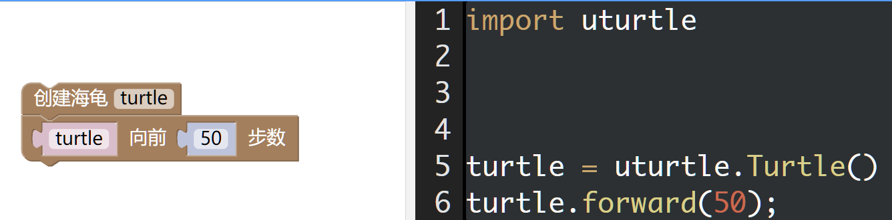

这里代码中的`turtle`是新创建的海龟对象，可以重新命名。

### 尝试改变画笔配置

我们在上面的基础上增加改变画笔颜色后再向前移动50步。这样我们可以看到连续的2个线段分别是黑色和红色。

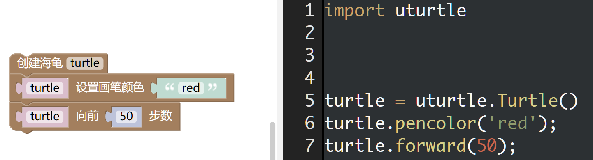

### 改变海龟方向

在绘图之前先改变海龟方向。尝试作图，改变海龟方向使用的是`skidws->屏幕`中的`旋转`模块。

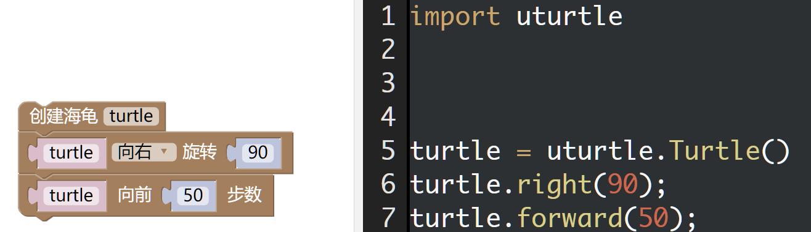

### 翻转：修改画笔配置和海龟方向后绘图

在skids上`垂直向下`绘制一个`50步`数的`红色`线段。
效果如下图所示

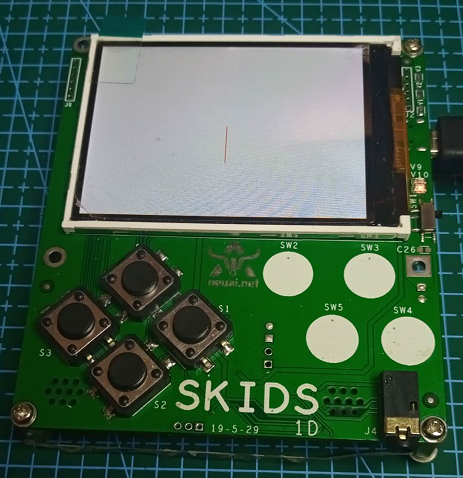

### 方形螺旋线绘制

同时画笔颜色、海龟角度、海龟移动不熟。可这样的修改实现：每次向右转90度，每次长度增加5个步数，并且设置第一次修改步数为5。

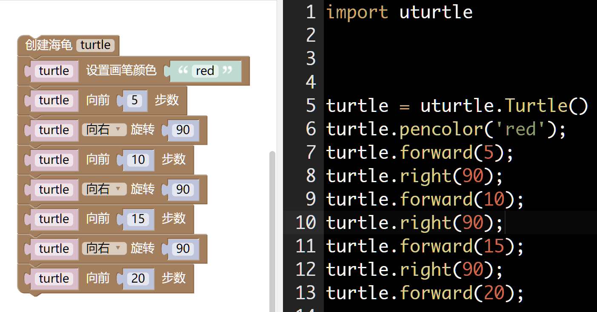

执行程序后可以看到一个螺旋线段图案，如果要继续循环下去要怎么做呢？请回想之前游戏中用到的循环执行。


### 翻转：螺旋线段

使用`逻辑->重复-满足条件-真`，`逻辑->如果-执行`,`逻辑->等于`和`数学->a+=1`模块进行**配置**实现。
思路：
1. 循环之前定义两个变量，一个决定循环次数，一个决定移动步数
2. 循环中判断变量是否小于某个值（30）
    1. 如果不小于执行上面的程序单元：旋转90+移动
    2. 循环次数和步进数增加

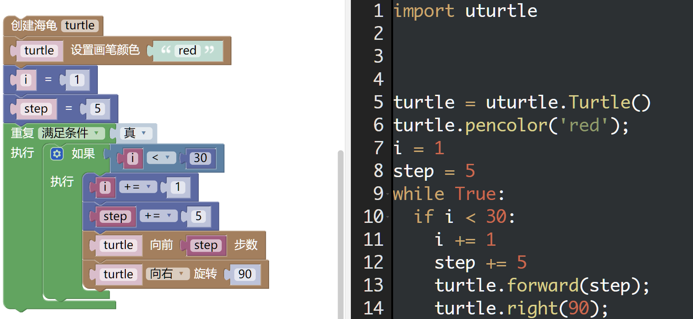


### 翻转：螺旋线段2

在上一个基础上让线段整体旋转45度，效果如下图

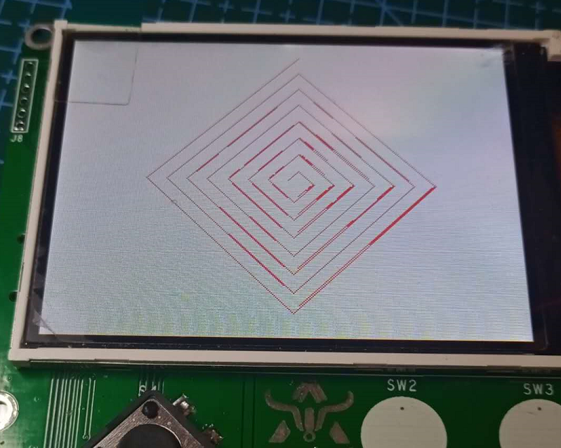

方法很简单，只需要在`while`之前先旋转45度即可。

## 重复执行

上面的重复执行中用：重复执行+如果执行，实现了执行30次。那么能不能把重复执行和如果执行合并呢？当然是可以的，方法也很简单只需要把如果中的条件替换到重复执行的`真`即可。

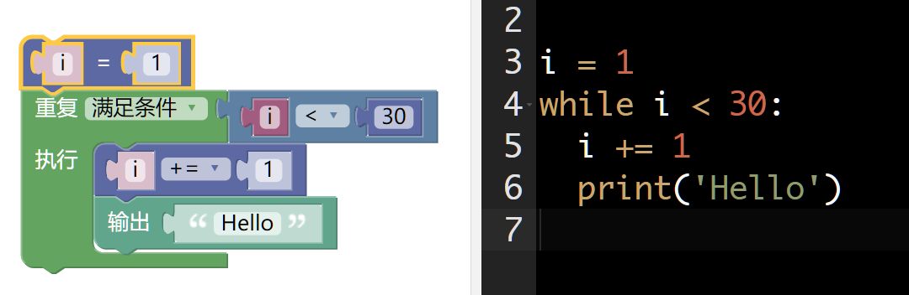

这样代码和逻辑即可得到进一步的简化。

当然这里的循环次数还有另外两个个模块可以实现：`重复执行i`和`对[]中的每个项目i执行`。

其中`重复执行i`中包含有一个逻辑i是否为真，在python中这个i只要为不是0，不是空(null)的值则均为真(true)。

### 翻转：使用while循环实现上面的螺旋线段

### 翻转：使用for循环实现上面的螺旋线段[可选]

`对[]中的每个项目i执行`需要把每个数字都写出来，代码为`for i in [0,1,2,3]`，这里还有一种是`for in in range(0,30)`，后面这个可执行30次，每次i的值加1，需要手动修改代码进行实现。


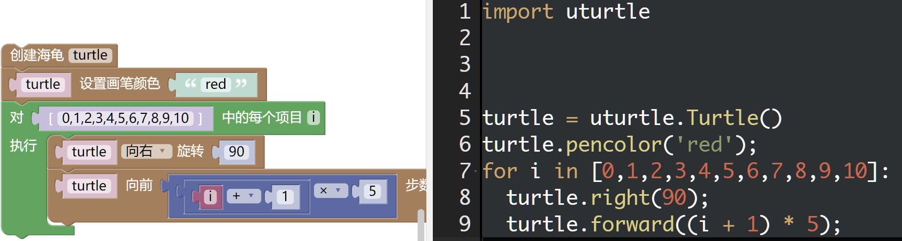

修改后代码
```
import uturtle

turtle = uturtle.Turtle()
turtle.pencolor('red');
for i in range(30):
  turtle.right(90);
  turtle.forward((i + 1) * 5);

```

## 抬笔与落笔

上面我们掌握了通过`forward`绘制直线，当我们完成一个区域的绘图后需要在另一个区域绘图时，海龟的移动过程不能绘制图案，所以此时需要抬起画笔，当移动到指定位置时在落笔绘画。

我们以下面这个图案为例进行学习。可以看到下面的线段起点相同，长度不一，方向逐渐旋转。
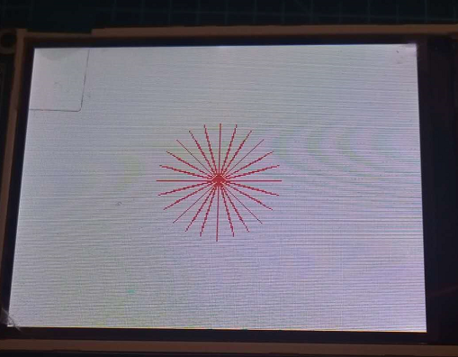

实现思路：
* 移动角度a=15，循环24次，360=15*24
* 移动长度L1
* 旋转180度
* 抬笔
* 移动长度L1
* 落笔

代码：
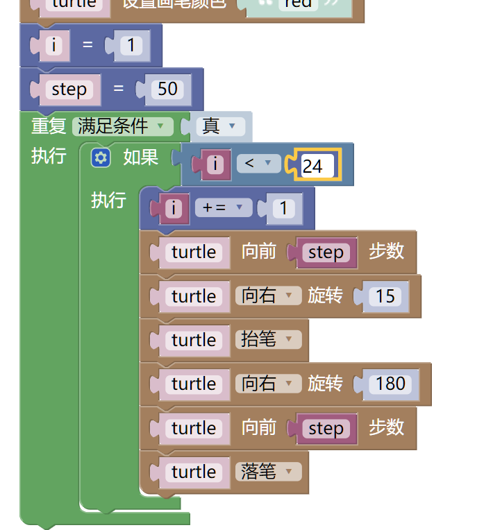

检查发现是代码**执行顺序错误**，思路是先旋转移动。实现中却是先移动后旋转，这样的执行结果就成了旋转180-15，所以并没有回到原点。

## 翻转：旋转的线段

类似表盘效果

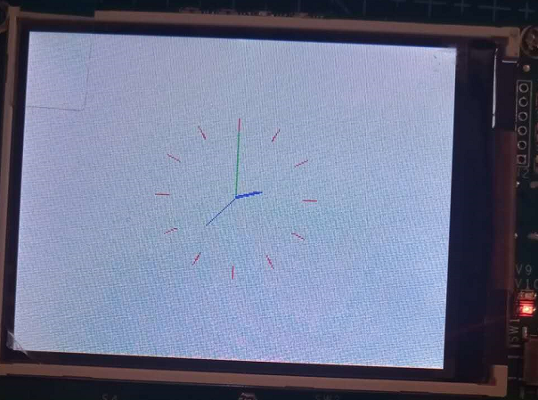

思路：
1. 用上面方法先绘制指针
2. **设置海龟朝向0度，或者重置/返回原点（后面2个需要验证）**
3. 绘制红色短线

## 画矩形

有了上面的经验之后，矩形的绘制已经十分简单了，主要是`向前`+`90度旋转`。


### 翻转：先自行实现矩形绘制

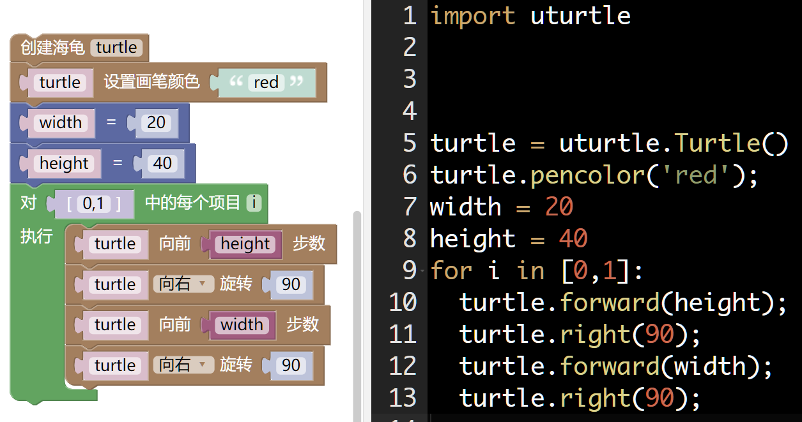


### 画矩形函数封装

之前已经用过函数，此处绘制矩形功能比较明确，所以可将其封装为函数以供调用。

函数的功能我们可描述为：在某个坐标(x,y)位置，绘制(w*h)矩形的矩形。

所以函数入口参数至少有4个：x, y, w, d。函数不需要返回值。

函数设计与函数调用

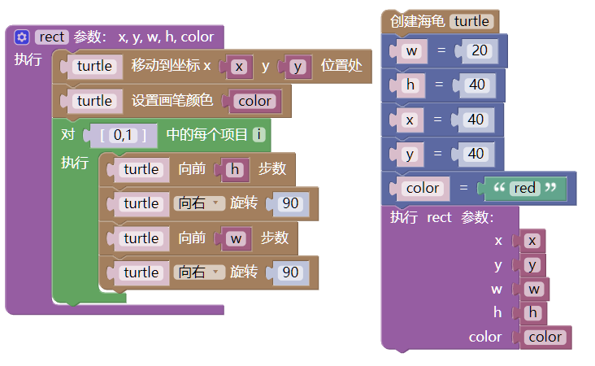

### 翻转：修改程序bug

从上面执行结果上看是有问题的，海龟从坐标原点到`goto`设定的地址过程中也有绘图。请改善此bug。

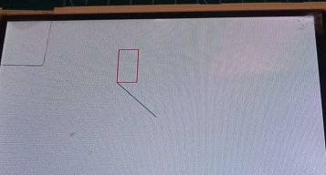

### 矩形填充

有了上面的函数封装后，就可以很容易地绘制矩形了。方法是在执行`rect`之前先执行`turtle 开始填充`，执行`rect`之后再执行`turtle 结束填充`。

**翻转**：实现填充功能

```python
turtle = uturtle.Turtle()
w = 20
h = 40
x = 40
y = 40
color = 'red'
turtle.fillcolor('green');
turtle.begin_fill();
rect(x, y, w, h, color)
turtle.end_fill();
```

## 翻转：画国旗

绘制德国国旗：德国国旗，呈横长方形，长与宽之比为5:3；自上而下由黑、红、金三个平行相等的横长方形相连而成。德国三色旗的来历最早可追溯到一世纪的古罗马帝国。
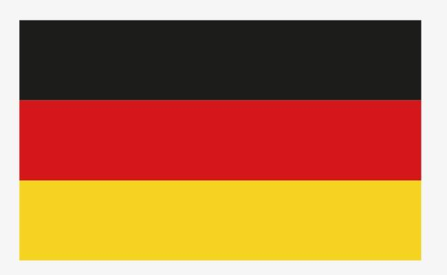

绘制意大利国旗：也叫意大利三色旗，旗面由三个平行相等的竖长方形相连构成，从左至右依次为绿、白、红三色，和国歌Il Canto degli Italiani (也作Fratelli d'Italia)一起成为意大利民族的象征。比例2:3。


**德国国旗画图参考：**

国旗比例为5:3，设定画图长度为250，那么宽度为150，三个色块宽度分别是50，以turtle(0,0)为中心的话，黑色色块的左下角坐标为(25，125)。这里要注意屏幕与坐标系的方向。

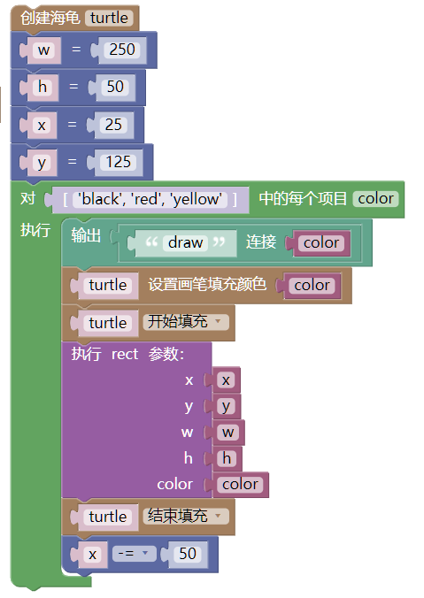
仍可优化为：**x -= h**


**翻转：意大利国旗类同**

## 画圆形


与绘制矩形类型，我们可以把画圆封装为一个函数：以某个坐标(x,y)为圆心，以r为半径，绘制角度为angle的圆弧。

真正绘图是调用turtle库的绘制圆形，这个模块有半径，角度，边数，三个参数。所以外部调用时还需要增加参数边数(sides，这里我们可以想象美术中是如何不借助工具画正圆的，先画正方形，再内切画出正8边形，再画正16变形...

根据上面分析和矩形函数，可很容易完成画圆的函数封装

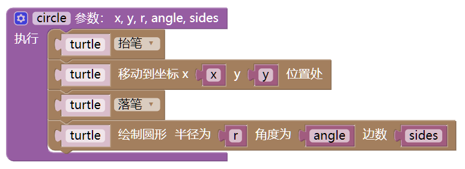


### 外切画圆

我们使用类似美术画圆的方法尝试画圆：
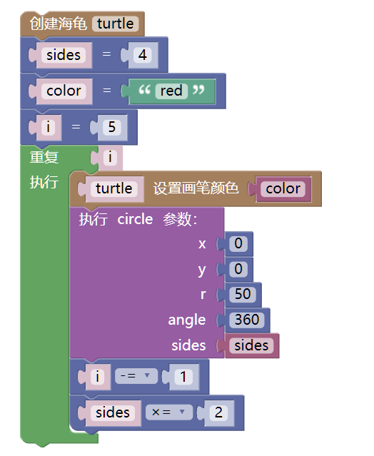


由图可以看出边数超过32就已经接近圆了

### 画圆函数修改bug

改进bug，上图实现的是从某个坐标起点开始画圆的，请修改为从设定坐标为圆心开始画圆。方法1：

* 移动到指定坐标后，在向前移动半径步数

此方法并不能解决，观察发现画图时总是逆时针方向绘制，尝并且绘制方向为当前方向，因此可试方法二：
* 移动到指定坐标
* 移动半径步数
* 相反方向旋转90度，向左旋转。

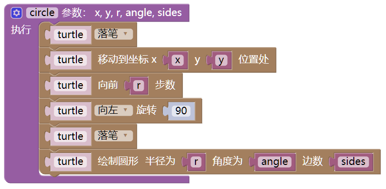

### ~~翻转：画太极图~~

思路：
1. 分别以半径R绘制黑色、白色的半圆
2. 以直径1/4处为圆心，以R/2为半径绘制2个小圆
3. 以在第二步的圆心位置，以R/4为半径绘制2个鱼眼

**暂不支持圆形填充**

## 画石头、剪刀、布


石头、剪刀、布。目前我们学习了直线、矩形和圆形的绘图过程。可以用线段绘制V形表示剪刀，用8边形表示石头，用正方形表示布，来分别设计不同的图案。

### 翻转：实现图标绘制

实现如下图案
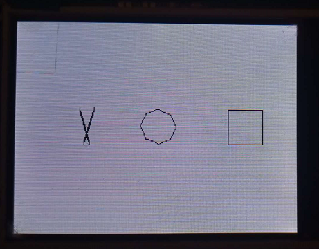

## 实现图形版猜拳游戏

思路：

* 设计屏幕规划好坐标
* 把石头、剪刀、布的绘制封装为函数。
* 在原来需要显示文字的地方，把相关代码替换为绘制图形


```python

```
